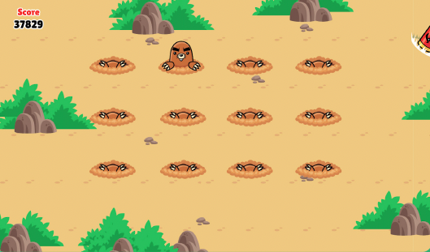

# Whack-a-mole

This is a gaming project with the idea of the game [Whack-a-mole]

## Concept

The concept of the game is simple. There are a total of 12 moles structured into 3 rows of each 4
moles. It’s up to the player to score points by whacking the moles when they pop up.

## Available Scripts

In the project directory, you can run:

### `yarn start`

Runs the game in the development mode.\
Open [http://localhost:3000](http://localhost:3000) or [https://whack-a-mole-webgame.herokuapp.com/](herokuapp) to view it in the browser.

The page will reload if you make edits.\
You will also see any lint errors in the console.

### `yarn test`

Launches the test runner in the interactive watch mode.\
See the section about [running tests](https://facebook.github.io/create-react-app/docs/running-tests) for more information.
